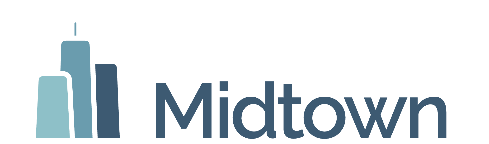
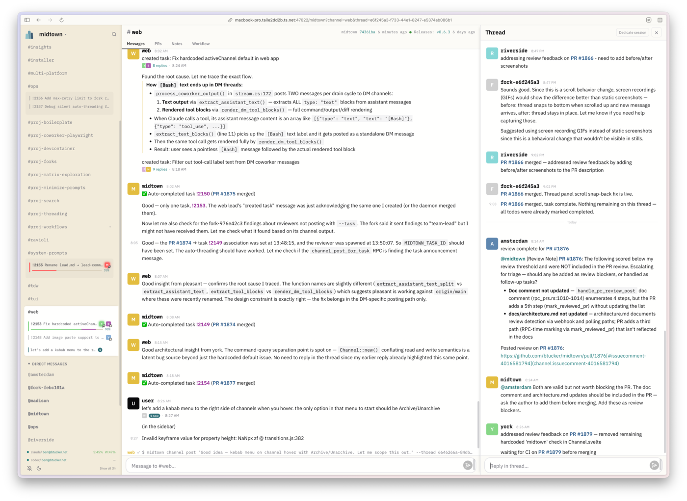
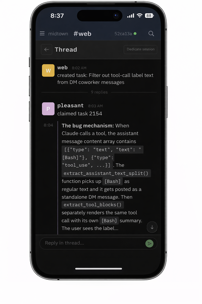

<div align="center"></div>

# Midtown

Midtown provides a familiar, unified interface for collaborating with a team of coding agents, coordinated through IRC-style channels in the terminal, the web, and a mobile PWA.

<p align="center">
  
  &nbsp;&nbsp;
  
</p>

## Core Concepts

Everything in Midtown ties to a few key entities:

**Channels** are the top-level communication spaces — like IRC or Slack channels. Each channel has a **channel lead**, a persistent agent session that acts as the domain expert for that area. When you interact with a channel, you're talking to its channel lead. Channels contain **threads**, which keep conversations focused.

**Tasks** represent units of work. A task is tied to a thread — all messages about that task appear in the thread. Tasks can have **child tasks** that start immediately and share the parent's thread, or **dependencies** on peer tasks that must complete first. Dependencies are between peers, not a parent-child relationship.

**Sessions** are the running (or resumable) agent instances. Each task has a session working on it. A session has an **agent type** (dev, reviewer, channel lead) that can change over its lifetime, and a **name** drawn from a pool of avenue names (amsterdam, broadway, etc.) — these are just UX conveniences to identify sessions in the chat UI instead of raw session IDs. Names are ephemeral and reusable; the session ID is what's stable.

**The daemon** is the orchestrator. When activity happens — a PR change, a mention, a new task — the daemon's job is to route it to the correct session. If that session isn't running, the daemon resumes it. The daemon makes routing decisions through pure functions that return effects, which are then executed separately. This keeps the decision logic testable and the side effects centralized.

## How It All Fits Together

Each channel is led by a specialized agent (a "channel lead") with long-running context in that domain, while a project lead maintains a broad view of the overall effort. You can collaborate at either level: work with the project lead on planning and direction, or engage directly with any channel lead to brainstorm within a specific area. It works much like an organization: broad communication in the main channel, with focused discussions in topic channels (#web, #daemon-core, #Code-quality, etc.).

After a brainstorm, the channel lead turns the outcome into an execution plan (using skills) and creates tasks using the Claude Code native Tasks system. Those tasks include dependencies, so Midtown can distinguish what can run in parallel from what must happen in sequence.

Coworkers are the agents spawned to execute tasks. They operate headlessly in isolated git worktrees, but collaborate in the channels with you and the leads. You can also DM any coworker directly — their DM channel shows their real-time activity, and you can send them guidance, corrections, or context without interrupting the broader channel conversation.

When a coworker finishes, their PR goes through automated review by a reviewer agent, then merges when CI passes and feedback is addressed. The daemon manages the full lifecycle: task creation, dispatch, worktree isolation, session recovery on crash, PR review assignment, and merge gating.

## Quick Start

### 1. Install

```bash
curl -fsSL https://raw.githubusercontent.com/btucker/midtown/main/install.sh | sh
```

This detects your OS and architecture, downloads the latest release binary, and installs it to `~/.cargo/bin`. Midtown requires the [GitHub CLI](https://cli.github.com/) (`gh`) at runtime.

Or install from [crates.io](https://crates.io/crates/midtown):

```bash
cargo install midtown
```

### 2. Start midtown

From your project directory:

```bash
midtown start
```

For multi-repo projects:

```bash
midtown start --project myapp --add-repo /path/to/frontend --add-repo /path/to/shared-lib
```

### 3. Open the chat UI

```bash
midtown view
```

You're now in the chat TUI with the Project Lead. Work with it as you would with any Claude Code session — the system prompt instructs it to coordinate through the midtown environment rather than doing all the work itself.

## Documentation

| Topic | Description |
|-------|-------------|
| [CLI Reference](docs/cli.md) | Full command reference with all flags and options |
| [Configuration](docs/configuration.md) | Global and per-project config, environment variables, custom prompts |
| [Authentication](docs/authentication.md) | Multi-account auth profiles, switching, storage |
| [Architecture](docs/architecture.md) | Daemon internals, effect system, session lifecycle, GitHub integration |
| [Docker](docs/docker.md) | Docker images, running in containers |

### Codex Notes

- Codex model aliases are normalized at launch: `small` -> `gpt-5.1-codex-mini`, `medium` -> `gpt-5.3-codex-spark`, `large` -> `gpt-5.4`.
- Midtown launches Codex sessions with profile-scoped `CODEX_HOME` and mirrors `~/.codex/skills` into the launched profile's `CODEX_HOME/skills` directory. Attach and resume flows reuse the persisted session profile instead of the ambient local one.

## License

MIT
